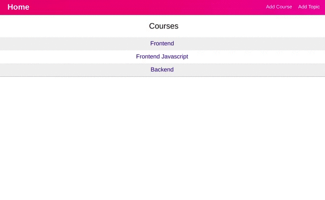

# Courses App

React App to Manage Courses

# Preview



# Various Functionality

1. Adding new Course.
2. List all the Courses
3. Add topic to the Course.
4. List topic of the particular course.

# Techstack

### HTML, CSS, JS, React, NodeJS

# Instructions to install

1. Clone this repository fromhttps://github.com/dheerajk7/helix-tech-assignment.git
2. Install NPM if you have not installed yet.
3. Go to project directory and run these commands to run API Server

   #### To install node Modules

   ```
   npm install
   ```

   #### To run project

   ```
   npm start
   ```

4. Go and check API at http://localhost:8000/api/v1.

5. Go to project directory and go inside client directory and run these commands to run React App

   #### To install node Modules

   ```
   npm install
   ```

   #### To run project

   ```
   npm start
   ```

6. Go and check React App at http://localhost:3000.

# Directory Structure

`/` - all MERN app files <br>
`/config/` - all configuration files <br>
`/models/` - all models files <br>
`/routes/` - all routes files <br>
`/controllers/` - all controllers files <br>
`/client/` - all react app files <br>
`/client/src` - all react app code files <br>
`/client/src/components`- all react component files <br>
`/client/src/store`- redux store files <br>
`/client/src/actions`- all actions files <br>
`/client/src/reducers`- all reducers files <br>
`/client/src/styles` - all CSS style files <br>
`/client/src/helper` - all helpers files <br>

---
